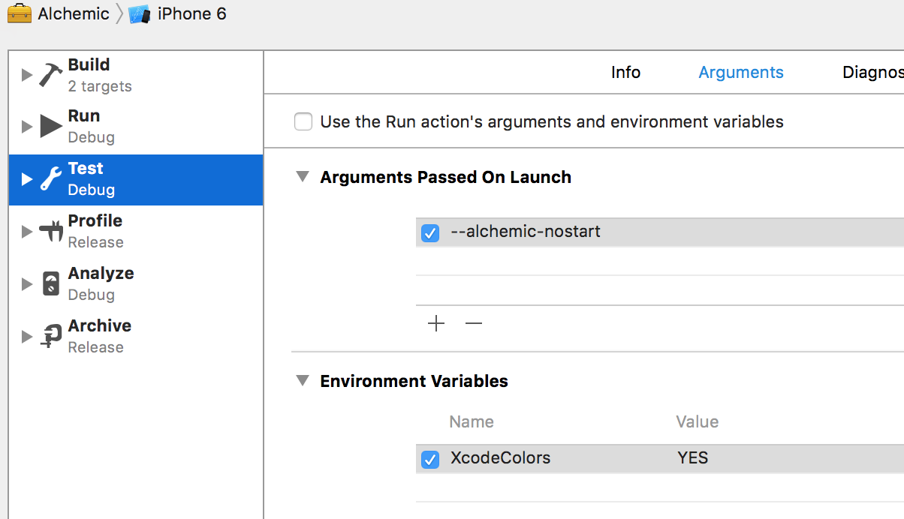

# Alchemic [](https://github.com/Carthage/Carthage)
By Derek Clarkson

<form name="switcher">
<input type="radio" name="switchers" value="objc" checked onclick="javascript:switchToObj();"> Objective-C<br>
<input type="radio" name="switchers" value="swift" checked onclick="javascript:switchToSwift();"> Swift<br>
</form>

<script type="text/javascript" defer="defer">

func switchToObjc() {
switch("highlight-source-objc", "inline");
switch("highlight-source-swift", "none");
}
func switchToSwift() {
switch("highlight-source-objc", "none");
switch("highlight-source-swift", "inline");
}

func switch(cssClass, displayStatus) {
var myElements = document.querySelectorAll("." + cssClass);
for (var i = 0; i < myElements.length; i++) {
myElements[i].style.display = displayStatus;
}
}

switchToObj();

</script>

### Other documents: 

* [What is Direct Injection (DI)?](./WhatIsDI.md)
* [Objective-C quick guide](./Quick guide - Objective-C.md)
* [Swift quick guide](./Quick guide - Swift.md)

### Readme  


#Intro

Alchemic is a [Dependency Injection](https://en.wikipedia.org/wiki/Dependency_injection) (DI) framework for iOS.  It's based loosely on some ideas from the [Spring](http://projects.spring.io/spring-framework/) Java framework, and my frustration at the limitations of various other iOS DI frameworks I tried. 

##Main features
* Supports both Objective-C and Swift.
* Self starting on an asynchronous background thread.
* Managed objects are self registering through macros or methods.
* Classes, initializers or methods can be used to create objects.
* Singletons, factories or externally sourced objects can all be used.
* Support for injecting initializer and method arguments. 
* Injection values can be located by class, protocol or name.
* Injection values can be constant values.
* Declarations can be tagged as primary sources to give them priority.
* Automatic array injection by class, protocol or name.
* Circular dependency detection.
* Concise metalanguage using Objective-C macros or Swift function.
* Automatic injection of UIApplicationDelegate dependencies.

# Swift support

Alchemic now supports classes written in Swift 2.0+ code. However the way you declare things to Alchemic is different because of various differences between the Objective-C and Swift languages. So the examples used in this document include an Objective-C and Swift example to illustrate the differences.

A major problem for any code attempting to interact with the Swift runtime is the translation from it to the Objective-C equivalents. As Alchemic is written in Objective-C, there are several considerations that must be kept in mind when using Alchemic with Swift source code.

### Registered classes

Any class that you want it's instances to be managed by Alchemic must inherit from **NSObject**. This is because Alchemic is an Objective-C API and internally only works with Objective-C instances.

### Functions
When using **AcMethod** or other functions that access swift functions, these functions must be annotated with **@objc**. This ensures that they are visible to Objective-C so that Alchemic can access them.

### Properties

When injecting values using **AcInject** into properties, the type of the property must be an Objective-C type. NSObject, NSNumber or any class that extends NSObject.   

### Arguments

Arguments passed to Alchemic functions such as **AcValue** do not have to be Objective-C types. For example, Alchemic can easily understant Swift strings in this context. However they must eventually be resolvable to Objective-C types as per the Swift documentation. 

# Installation

## [Carthage](https://github.com/Carthage/Carthage)

[](https://github.com/Carthage/Carthage)

If your not using [Carthage](https://github.com/Carthage/Carthage), I would like to suggest that you take a look if you developing for iOS 8+. IMHO it's a far superior dependency manager to Cocoapods, less intrusive and simpler to work with.

Add this to your **Cartfile**:

github "drekka/alchemic" > 1.0

Then run either the **bootstrap** or **update** carthage commands to download Alchemic from and compile it and it's dependencies into the  **<project-dir>/Carthage/Build/iOS/** directory. You can then include the frameworks into your project the same way you would add any other framework. 

Framework | Description
--- | ---
Alchemic.framework | This is the Objective-C core of Alchemic. It's required for both Swift and Objective-C projects.
AlchemicSwift.framework | *ONLY* required for Swift projects. This framework provides the bridging functions that enable Swift calls to Alchemic to look as similar as possible to their Objective-C macro equivalents. 
Storyteller.framework | [Story Teller](https://github.com/drekka/StoryTeller) is a alternative logging framework I designed along side Alchemic.
PEGKit.framework | Used by StoryTeller.

*Note: You will need to ensure that all of these frameworks are added to your project and copied to the __Frameworks__ directory in your app.* 

# Alchemic's boot sequence

Alchemic will automatically start itself when your application loads. It follows this logic:

1. Starts itself on a background thread so that your application's startup is not slowed down.
2. Scan all classes in your app for dependency injection commands. 
3. Resolve all references and configure an internal model based on the found declarations.
3. Instantiate any classes declared as Singletons and wire up their dependencies.  
4. Check for a UIApplicationDelegate and if found, injection any dependencies it has declared.
5. Executes post-startup blocks.
5. Post the ["AlchemicFinishedLoading"](#finished-loading) notification.

*Look at [Asynchronous startup](#asynchronous-startup) for more details on Alchemic's starting and how to know when you can access objects.*

# Adding Alchemic to your code

To use Alchemic, import the Alchemic umbrella header at the top of your implementations (___*.m___ files). 

```objectivec
// Objective-C
#import <Alchemic/Alchemic.h>
```

```swift
// Swift
import AlchemicSwift
```

*Alchemic works with implementations rather than the headers. This means it can access methods and initializers that are not public or visible to other classes.  The advantage of this is that you have the ability to create initializers and methods which only Alchemic can see. Thus simplifying your headers.*

# How Alchemic reads your code

Alchemic is designed to be as unobtrusive as possible. But it still needs to know what you want it to do. With Objective-C source code it makes use of pre-processor macros to tell it what to do. With Swift source code it uses a specific function with each class and a set of global functions to tell it the details.  

## Objective-C macros

In Objective-C classes Alchemic uses pre-processor macros as a form of meta-data, similar to Java's annotations. These macros are generally pretty simple and easy to remember and it's likely that within a short time you will being using them without much thought. 

Most of these macros take one or more arguments. For example the `AcArg(...)` macro takes at least two arguments and possibly more. To help keep the macros susinct and avoid having to type needless boiler plate, they only need the raw class and protocol names, variable names, selectors, etc. For example:

```objectivec
// This macro
AcProtocol(NSCopying)
// generates this code
[ALCProtocol withProtocol:@protocol(NSCopying)]
```

Some of Alchemic's macros like `AcProtocol(...)` are designed to be used as arguments to other macros. Others such as `AcGet(...)` are designed to be used in an Objective-C method. 

Some such as `AcRegister(...)` are designed to be used at the class level and un-wrap themselves into additional class methods. The presense of these methods is how Alchemic recognises the classes it has to manage.

## Swift functions

Getting Swift classes to be recognised by Alchemic has to be done differently to Objective-C. For Alchemic to recognise a Swift class, you need to implement a function in it with this signature:

```swift
class MyClass {
public static func alchemic(cb: ALCBuilder) {
/// Alchemic setup goes here.
}
}
```

Alchemic will automatically find and execute every occurance of this function as it starts up. Inside them you place calls to Alchemic's Swift functions to tell it about what you want it to do. These functions are very simular to their Objective-C macro counterparts.

*Note: It's required that the function is __public__ for Alchemic to be able to see it. However sometimes you cannot make the function public (when using inner classes for example). In these situations you can change it to __@objc__ instead.*

# Creating objects

Before we look at resolving dependencies and injecting values, we first need to look at how we tell Alchemic about the objects we want to create.

## Builders

Alchamic uses what it calls '**Builders**' to declare how objects are created. They can both build objects and inject dependencies. There are 3 types of builders:

* **Class builders** which define information about a class and can build instances of that class. Class builders also hold information about dependencies that the class may have and how they are located and injected.
* **Initializer builders** which define information about a class's initializer and can build instances of the class by executing the initializer and passing it arguments. 
* **Method builder** which define information about a method in a class and can build objects by calling the method and returning the result. Method builders are very similar to initializer builder, only differing in how the method is called and that they can return anything the method generates as a return value.

## Declaring singletons 

No matter what kind of appplication you are writing, you will probably have some objects are created once and used everywhere. For example - an object which manages communication with a server or database. These are usually referred to as [Singletons](https://en.wikipedia.org/wiki/Singleton_pattern). 

There are a number of opinions amongst developers about singletons and how they should be declared and used in code. Alchemic's approach is to assume that builders represent a singleton by default. It keeps one instance of the class in it's context and injects it where ever requested. However it doesn't do anything to stop you creating other instances of that class outside of the context. To tell Alchemic that a particular class is to be treated as a singleton, use this macro in the class's implementation:

```objectivec
// Objective-C
@implementation MyClass
AcRegister()
@end
```

```swift
// Swift
class MyClass {
public static func alchemic(cb: ALCBuilder) {
AcRegister(cb)
}
}
```

This is the simplest form of registering a class with Alchemic. **AcRegister** tells Alchemic that this class need's it's instances managed. When starting, Alchemic will consider any such class for auto-instantiating on startup.

*Note: __AcRegister__ should only be used once in the class.*

## Using initializers

By default, Alchemic will use the standard `init` method when initializing an instance of a class. However this is not always what you want, so it also provides a way to specify an initializer to use and how to locate any arguments it needs:

```objectivec
// Objective-C
@implementation MyClass
AcRegister()
AcInitializer(initWithOtherObject:, AcArg(MyOtherClass, AcClass(MyOtherClass))
-(instancetype) initWithOtherObject:(id) obj {
// ...
}
@end
```

```swift
// Swift
class MyClass {
@objc func init(otherObject: AnyObject) {
// ...
}
public static func alchemic(cb: ALCBuilder) {
AcRegister(cb)
AcInitializer(cb, 
initializer:"initWithOtherObject:", 
args:AcArg(MyOtherClass.self, source:AcClass(MyOtherClass.self))
)
}
}
```

**AcInitiailizer** tells Alchemic that when it needs to create an instance of MyClass, it should use the passed initializer selector. For each argument the initializer requires, a matching **AcArg** can be specified which define where to get the value for it. 

### Declaring method arguments using AcArg

**AcArg** helps both **AcInitializer** and **AcMethod** locate argument values to be passed to the methods they are going to execute. The first argument to **AcArg** defines the argument type. This is used when checking candidate values. After that is a list of one or more [Object search criteria](#object-search-criteria) that define where to source the value from. 

Value for an argument can come from other model objects, or can be defined as constant values. They can also be **nil** if you want to pass a nil. 

*Note: When there is more than one __AcArg__ arguments, they must be in the same order as the selector's arguments.*

## Object factories

Sometimes you want to declare a class to Alchemic, but have Alchemic create a new instance every time you need the object. This is known as a ***Factory***. Factories are not as common as singletons in the DI world, but they can be useful in a variety of situations. For example, you could declare an email message class as a factory. Then every time you need one, Alchemic will create a new message object and give it to you with all it's dependencies injected.

To tell Alchemic to treat a class registration as a factory, add **AcFactory** to **AcRegister** like this:

```objectivec
// Objective-C
AcRegister(AcFactory)
```

```swift
// Swift
public static func alchemic(cb: ALCBuilder) {
AcRegister(cb, AcFactory())
}
```

Now every time your code requests an instance of the class, a new one will be created and returned. 

*Note that __AcFactory__ can also be added to __AcMethod__ when defining methods that create instances.*

## Giving builders custom names

Objects are automatically given a name when they are registered and by defaultit's the class name. This name is indexed and can be used to find particular builder registrations quickly. However the name of the class is not always the best choice, so Alchemic provides a way to index the builder under a name of your choosing. Adding the **AcWithName** macro to the builder registration you can specify a custom name to use to index the builder. 

```objectivec
// Objective-C
AcRegister(AcWithName(@"JSON date formatter"))
```

```swift
// Swift
public static func alchemic(cb: ALCBuilder) {
AcRegister(cb, AcWithName("JSON date formatter"))
}
```

An example of using naming might be that you register several `NSDateFormatter` objects with Alchemic and give them names like *'JSON date formatter'*, *'DB date formatter'*, etc. Then when you need a `NSDateFormatter`, you can inject the relevant one by using **AcName** to locate it by name.

*Note: names __must__ be unique. This aids in searching for objects to inject.*

## Generating objects using methods or functions

Sometimes we want to use Objective-C methods or Swift functions to create objects for injecting into dependencies. For example, we might want to generate a `Transaction` object based on some passed arguments. 

*Unfortunately the Objective-C runtime does not track any information about the argument and return types of methods they way it does for variables. So there is no way for Alchemic to automatically discover information about a method at runtime beyond some very basic information. So we have to tell it a lot more information than we do for classes.*

Lets take a look at two sample methods which Alchemic will use to create objects:

```objectivec
// Objective-C
@implementation Factory {
int x;
}

AcRegister()

// First a singleton
AcMethod(Database, generateDatabaseConnection)
-(id<DBConnection>) generateDatabaseConnection {
// Complex connection setup code.
return dbConn;
}

// And a factory
AcMethod(NSString, makeATransaction, AcFactory))
-(Transaction *) makeATransaction {
return [[Transaction alloc] 
initWithName:[NSString stringWithFormat:@"Transaction %i", ++x]];
}
@end
```

```swift
// Swift
class Factory {
var x

public static func alchemic(cb: ALCBuilder) {
AcRegister()
AcMethod(cb, method:"generateDatabaseConnection", type:DBConnection.self)
AcMethod(cb, method:"makeATransaction", type:Transaction.self, args:AcFactory())
}

// First a singleton
@objc func generateDatabaseConnection() -> DBConnection {
// Complex connection setup code.
return dbConn
}

// And a factory
@objc func makeATransaction -> Transaction {
x++
return Transaction("Transaction \(x)")
}
}
```

We use **AcMethod** to define any method or function that can create objects. This is similar to **AcRegister** in that it registers a source of objects which can be injected into other things. 

The first example creates a singleton instance. Alchemic will only call the method once and cache the returned object for later injections. The second example which generates transactions needs to create a new one each time. So it has **AcFactory** set. 

Factory registrations also have names so they can be located. Alchemic uses a combination of the class and method selector using the format "*ClassName method:signature:*". Like class registrations, you can make use of **AcWithName** to give a factory a more meaningful and searchable name. 

Now lets take a look at a factory method with arguments:

```objectivec
// Objective-C
AcMethod(NSURLConnection, serverConnectionWithURL:retries:,
AcWithName(@"serverConnection"), 
AcArg(NSURL, AcName(@"db-server-url")),
AcArg(NSNumber, AcValue(@5))
)
-(NSURLConnection *) serverConnectionWithURL:(NSURL *) url 
retries:(NSNumber *) retries {
// lots of complex setup code here that creates newConnection.
return newConnection;
}
```

```swift
// Swift
public static func alchemic(cb: ALCBuilder) {
AcRegister()
AcMethod(cb, method: "serverConnection:retries:", type:NSURLConnection.self,
AcWithName("serverConnection"),
AcArg(NSURL.self, source:AcName("db-server-url")),
AcArg(NSNumber.self, source:AcValue(5))
)
}
@objc func serverConnection(url:NSURL, retries:NSNumber) -> NSURLConnection {
// lots of complex setup code here that creates newConnection.
return newConnection;
}
```

Here we need to use **AcArg** to tell Alchemic where to get the values for each argument. Alchemic uses this information to select appropriate values and pass them as method arguments to the factory method when it's creating the object. 

Nils can also be passed as arguments. To do this you use **AcValue** with a nil argument as **AcArg**'s source. Alternatively, if *all* the remaining arguments to a method are nil, then simply leaving them out has the same effect as setting them to nil.

Here are some other examples of the above declaration with nils: 

```objectivec
// Objective-C
// Passing a nil URL.
AcMethod(NSURLConnection, serverConnectionWithURL:retries:,
AcArg(NSURL, AcValue(nil)),
AcArg(NSNumber, AcValue(@5))
)
// Passing a nil retries value.
AcMethod(NSURLConnection, serverConnectionWithURL:retries:,
AcArg(NSURL, AcName(@"db-server-url"))
)
// All arguments are nil
AcMethod(NSURLConnection, serverConnectionWithURL:retries:)
```

```swift
// Swift
public static func alchemic(cb: ALCBuilder) {
// Passing a nil URL.
AcMethod(cb, method: "serverConnection:retries:", type:NSURLConnection.self,
AcArg(NSURL.self, source:AcValue(nil)),
AcArg(NSNumber.self, source:AcValue(5))
)
// Passing a nil retries.
AcMethod(cb, method: "serverConnection:retries:", type:NSURLConnection.self,
AcArg(NSURL.self, source:AcName("db-server-url"))
)
// All arguments are nil.
AcMethod(cb, method: "serverConnection:retries:", type:NSURLConnection.self)
}
```

## Primary objects

When we have several possible candidate builders for a dependency, we might not want to use custom names to get the exact one we want, but we still need to be able to select just one. Alchemic can define one builder as the default one for these situations. It has the concept of ***Primary*** objects which it borrowed from the [*Spring framework*](http://spring.io). 

The basic idea is that when multiple builders can satisfy a dependency, you can flag one of them as the *'Primary'* builder. If Alchemic has more than one possible candidate builder for an injection and one of them is tagged as a primary, it will automatically choose that builder as the one to use. 

Here's how to declare a Primary:

```objectivec
// Objective-C
AcRegister(AcPrimary)
```

```swift
// Swift
public static func alchemic(cb:ALCBuilder) {
AcRegister(cb, AcPrimary())
}
```

Primary objects are ***only*** checked once a list of candidate builders for ain injection have been located. This ensure that they don't override more specific criteria.

*Whilst this can solve situations where multiple candidates for a dependency are presents, if Alchemic finds Multiple Primary buildr for a dependency, it will still raise an error.*

### Primary objects and testing

Primary builders are most useful in testing. You can register mock or dummy classes from your test suites as Primaries. When Alchemic loads, these test builders will then become the defaults to be injected instead of the production objects, all without having to change a single line of code.

# Injecting dependencies

The main point of a DI framework is to locate an objects dependencies and inject them without you having to write code to do it. In other words, to save the writing of a lot of [boiler plate](https://en.wikipedia.org/wiki/Boilerplate_code) code. Alchemic specifies variable dependencies using **AcInject** with a variety of arguments telling it what to inject. 

*Note: Whilst Alchemic can inject values into properties as easily as variables, it does not trigger KVO when doing so. __So don't depend on KVO to detect injections__.*

## Objective-C 

Here's a basic Objective-C example:

```objectivec
// Objective-C
@interface MyClass
@property(nonatomic, strong, readonly) MyOtherClass *otherObj;
@end

@implementation
AcInject(otherObj)
// Rest of class ...
@end
```

When being used in Objective-C source code, Alchemic can inject public properties like the above example, but also private properties and variables. You can also use the internal name of properties if you want. So all of the following will work:

```objectivec
// Objective-C
@interface MyClass
@property(nonatomic, strong, readonly) MyOtherClass *otherObj;
@end

@implementation {
YetAnotherClass *_yetAnotherObj;
}

AcInject(otherObj)
AcInject(_otherObj)
AcInject(_yetAnotherObj)
// Rest of class ...
@end
```

When there is no arguments after the variable name, Alchemic will it up based on the name, work out what class and protocols the variable's type implements, and use that information to locates potential candidates within the context. 

## Swift

Here's a simple Swift example of specifying an injection:

```swift
// Swift
class MyClass
var otherClass:MyOtherObj?
public static func alchemic(cb: ALCBuilder) {
AcInject(cb, variable:"otherObj", type:MyOtherClass.self))
}
}
```

There are a couple of rules when specifying injections in Swift: 

* You have to specify the type of the variable in **AcInject**. This is required because the Objective-C runtime that Alchemic uses is not able to determin the type of Swift variables as easily as it can when looking at Objective-C classes.
* The Swift variables have to be a tupe that Alchemic can inject. This means classes which extend NSObject. Alchemic cannot inject Swift types such as String or Int. 

## Finding objects

In order to inject a variable, Alchemic needs a way to locate potential values. Generally it can examine the variable and work out for itself what to inject. But often you might want to provide your own criteria for what gets injected. Plus there are some situations where the runtime cannot provide Alchemic with the information it needs to work out what to inject. 

### Searching by Class and Protocols

You can tell Alchemic to ignore the type information of the dependency you are injecting and define your own class and/or protocols to use for selecting candidate objects. Here's an example:

```objectivec
// Objective-C
AcInject(otherObj, AcClass(OtherClass))
AcInject(anotherObj, AcProtocol(MyProtocol))
``` 

```swift
// Swift
public static func Alchemic(cb:ALCBuilder) {
AcInject(cb, variable:"otherObj", type:NSObject.self, source:AcClass(OtherClass.self))
AcInject(cb, variable:"anotherObj", type:NSObject.self, source:AcProtocol(MyProtocol.self))
}
``` 

**AcInject** can take any number of Alchemic commands which are used to locate candidate builders. But you can only specify one **AcClass** and as many **AcProtocol**s macros as you want. It's quite useful when your variables are quite general and you want to inject more specific types. 

For example, assuming that `AmexAccount` implements the `Account` protocol, we can write this:

```objectivec
// Objective-C
@implementation {
id<Account> *_account;
}
AcInject(_account, AcClass(AmexAccount))
@end
```

```objectivec
// Swift
class {
var account:Account
public static func alchemic(cb:ALCBuilder) {
AcInject(cb, variable:"account", type:Account.self, source:AcClass(AmexAccount.self))
} 
}
```

As programming to protocols is considered a good practice, this sort of injection allows you classes to be quite general in how they refer to other classes, yet you can still locate specific objects to inject.

### Searching by Name

Earlier on we discussed storing objects under custom names in the context so they can be found later. Here's an example of how we use a custom name to locate a specific instance of an object:

```objectivec
// Objective-C
@implementation MyClass {
NSDateFormatter *_jsonDateFormatter;
}
AcInject(_jsonDateFormatter_, AcName(@"JSON date formatter"))
@end
```

```swift
// Swift
class MyClass {
var jsonDateFormatter:NSDateFormatter
public static func alchemic(cb:ALCBuilder) {
AcInject(cb, variable:"jsonDateFormatter", type:NSDateFormatter.self, source:AcName("JSON date formatter"))
}
@end
}
```

Again we are making a general reference to a `NSDateFormatter`, but using the name assigned by Alchemic to locate the specific one needed for the injection.

**AcName** must occur by itself as a criteria for finding builders as **AcClass** and **AcProtocol** become redundant when is used.

### Using constant values

Some times you might want to specify a constant value for a dependency. In this case we can use **AcValue** like this:

```objectivec
// Objective-C
@implementation MyClass {
NSString *_message;
}
AcInject(_message, AcValue(@"hello world"))
@end
```

```swift
// Swift
class MyClass {
var message:NSString
public static func alchemic(cb:ALCBuilder) {
AcInject(cb, variable:"message", type:NSString.self, AcValue("hello world"))
}
}
```

**AcValue** cannot occur with any of the search functions. **AcValue** can also pass a nil to the target method if you want.

## Injecting into arrays

Alchemic has another trick up it's sleeve borrowed from the [*Spring framework*](http://spring.io). If you want to get an array of all the objects that match a [search criteria](#object-search-criteria), you can just specify to inject an array variable, and Alchemic will automatically inject a `NSArray` instance containing all objects that match the criteria. 

For example, if we want a list of all NSDateFormatters objects that Alchemic is managing:

```objectivec
// Objective-C
@implementation MyClass {
NSArray<NSDateFormatter *> *_dateFormatters;
}
AcInject(_dateFormatters, AcClass(NSDateFormatter))
@end
```

```swift
// Swift
class MyClass {
var dateFormatters:NSArray
public static func alchemic(cb:ALCBuilder) {
AcInject(cb, variable:"dateFormatters", type:NSArray.self, source:AcClass(NSDateFormatter.self))
}
}
```

When processing candidate builders for an inejction, Alchemic will automatically check if the target variable is an array and adjust it's injection accordingly, wrapping objects in NSArrays as required. 

*Note: If the target variable is not an `NSArray` type and multiple objects are found, them Alchemic will throw an error.*

# Interfacing with Alchemic

Now that we know how to declare objects and inject them, lets look at how we retrieve objects in classes and code which is not managed by Alchemic. In other words, how to get Alchemic to work with the rest of your app.

## Non-managed objects

Not all objects can be created and injected by Alchemic. For example, UIViewControllers in storyboards are created by the storyboard.  However you can still declare dependencies in these classes and get them injected as if Alchemic had created them. 

Firstly when registering class injections, either avoid adding **AcRegister**, or add the **AcExternal** flag. Either method will tell Alchemic to use the builder for declaring injections only and to not create any instances. 

Later in your code you can make a call to trigger the injection process programmatically like this:

```objectivec
// Objective-C
-(instancetype) initWithFrame:(CGRect) aFrame {
self = [super initWithFrame:aFrame];
if (self) {
AcInjectDependencies(self);
}
return self;
}
```

```swift
// Swift
func init(frame:CGRect) {
AcInjectDependencies(self)
}
```

You can add **AcInjectDependencies** anywhere in the class. For example you might do it in the `viewDidLoad` method instead. 

*Whilst I looked at several options for automatically injecting storyboard created instances, I did not find any technique that would work well and required less code. So for the moment Alchemic does not inject dependencies into them automatically.*

## Programmatically obtaining objects

Sometimes (in testing for example) you want to get an object from Alchemic without specifying an injection.

### Getting objects using **AcGet**

**AcGet** allows you to search for and return an object (or objects) in a similar fashion to how **AcInject** works. Except it's inline with your code rather than a one off injection and can be accessed as many times as you like.

```objectivec
// Objective-C
-(void) myMethod {
NSDateFormatter *formatter = AcGet(NSDateFormatter, AcName(@"JSON date formatter"));
// Do stuff ....
}
```

```swift
// Swift
func myMethod() {
var formatter:NSDateFormatter = AcGet(AcName(@"JSON date formatter"))
// Do stuff ....
}
```

In Objective-C **AcGet** requires the first argument to be the type of what will be returned. This type is needed because the runtime does not know what is expected and Alchemic needs this information to finish processing the results. Especially if you are expecting an array back. In Swift, the runtime can deduce the type through Swift generics. 

Arguments after the type are search criteria used to find candidate builders. So **AcClass**, **AcProtocol**, **AcName**, or **AcValue** can all be used to either search the context for objects or set a specific value. Note that **AcGet** also does standard Alchemic `NSArray` processing. For example the following code will return an array of all Alchemic registered date formatters:

```objectivec
// Objective-C
-(void) myMethod {
NSArray *formatters = AcGet(NSArray, AcClass(NSDateFormatter));
// Do stuff ....
}
```

```swift
// Swift
func myMethod() {
var formatters = AcGet(NSArray.self, source:AcClass(NSDateFormatter))
// Do stuff ....
}
```

Finally, you can leave out the search criteria macros like this:

```objectivec
// Objective-C
-(void) myMethod {
NSDateFormatter *formatter = AcGet(NSDateFormatter);
// Do stuff ....
}
```

```swift
// Swift
func myMethod() {
var formatter = AcGet(NSDateFormatter.self)
// Do stuff ....
}
```

Without any criteria, Alchemic will use the passed return type to determine the search criteria for scanning the model based in it's class and any applicable protocols.

### Getting objects with **AcInvoke**

**AcInvoke** is for when you want to access a declared method or initializer and pass in the arguments manually. But you don't have access to the object it's declared on or may not even know it.  For example, you might declare a factory initializer like this:

```objectivec
// Objective-C
AcInitializer(initWithText:, AcFactory, AcArg(NSString, AcValue(@"Default message")
-(instancetype) initWithText:(NSString *) message {
// ...
}
```

```swift
// Swift
public static func alchemic(cb:ALCBuilder) {
AcInitializer(cb, initializer:"initWithMessage:", 
args:AcArg(NSString.self, source:AcValue(@"Default message"))
)
}
func init(message:NSString) {
// ...
}
```

In this scenario you want the factory method to give you a new instance of the object when you need it, but with a different message. So you can it like this:

```objectivec
// Objective-C
-(void) myMethod {
MyObj *myObj = AcInvoke(AcName(@"MyObj initWithText:"), @"Message text");
// Do stuff ....
}
```

```swift
// Swift
func myMethod() {
var myObj = AcInvoke(AcName("MyObj initWithText:"), args:"Message text")
// Do stuff ....
}
```

**AcInvoke** will locate all Alchemic declarations that match the first argument, which must be a search function. Normally it's **AcName** because the usual scenario is to be address a specific method or initializer. Once Alchemic has located the method, it then invokes it (in the case of a normal method) or creates an instance using it if it is an initializer. In either case the method being addresses **must** have been registered via **AcInitializer** or **AcMethod** so it can be found. 

Also note in the above example, we are using the default name for the method generated by Alchemic. Using **AcInvoke** is one good reason to make use of **AcWithName** to add custom names to registrations.

### Setting values with **AcSet**

Sometimes you have created an object outside of Alchemic, but want Alchemic to manage it. For example, you might have a view controller you want Alchemic to inject into other objects. You can use **AcSet** to do this:

```objectivec
// Objective-C
-(void) myMethod {
MyObj *myObj = ... // create the object. 
AcSet(myObj, AcName(@"abc"));
}
```

```swift
// Swift
func myMethod() {
let myObj = ... // create the object. 
AcSet(myObj, inBuilderWith:AcName("abc"))
}
```

Alchemic will locate the matching builder for the criteria passed as arguments after the object and set the object as it's value. **ACName** is most useful when setting values as **AcSet** expects there to be only one builder found by the passed crtieria. If zero or more than one builder is returned, **AcSet** will throw an error.

*Note: that setting a new object for a builder does not effect any previously injected references to the old object. Only injections done after setting the object will receive it.*

## Asynchronous startup

Alchemic bootstraps itself in a background thread rather than taking up precious time during your application's startup. However, it also means that any classes that make calls to **AcInjectDependencies** may attempt to execute before Alchemic has finished reading the classes and building it's model of your application.

To address this Alchemic provides an asynchronous callback which can be used in any code that runs at the beginning of your app and needs to ensure that something is execute after Alchemic has finished starting up. 

For example, you might have a table view controller that needs data from a singleton that Alchemic injects. To deal with this situation, you should engineer the table view controller to work if the singleton dependency is nil, and to register a callback which refreshes the table after Alchemic has finished loading like this:

```objectivec
// Objective-C
-(void) viewDidLoad {
AcExecuteWhenStarted(^{
[self.tableView reloadData];
});
}
```

```swift
// Swift
func viewDidLoad() {
AcExecuteWhenStarted {() -> Void in
self.tableView.reloadData()
}
}
```

If Alchemic has already finished starting then the block is executed immediately on the current thread. If Alchemic has not started then the block is copied, and executed after Alchemic has finished loading. It will then be executed on the **main thread**.

## Managing the UIApplicationDelegate instance

Alchemic has some special processing for `UIApplicationDelegates`. After starting, Alchemic will automatically search for a `UIApplicationDelegate` and if it finds one, inject any dependencies it needs. So there is no need to add any **AcRegister** calls to the app delegate class. By default, Alchemic will automatically add the application to its model and set it with your app's instance.

*Note: You can still use **AcRegister** to give the application delegate a name if you like.*

## Callbacks and notifications

### Dependencies injected

Sometimes it's useful to know when Alchemic has finished injecting values into an object. To facilitate this, a protocol is available which is called after an object has had it's dependencies injected:

```objectivec
// Objective-C
@interface MyClass:NSObject<AlchemicAware>
@end 

@implementation MyClass 
-(void) alchemicDidInjectDependencies {
// Do stuff
}
@end
```

```swift
// Swift
class MyClass:NSObject<AlchemicAware> {
func alchemicDidInjectDependencies() {
// Do stuff
}
}
```

This method will automatically be called after all dependencies have been injected. You actually don't need to use the protocol as Alchemic simply looks for the method. The protocol is just a convenience. 

*Also note that this method is __ONLY__ called on classes which Alchemic is managing or when **AcInjectDependencies** is used.*

### Finished loading

Once all singletons have been loaded and injected, Alchemic sends out a notification through the `NSNotificationCenter` object. There is a constant called `AlchemicFinishedLoading` in the `ALCAlchemic` class which can be used like this:

```objectivec
// Obejctive-C
[[NSNotificationCenter 
defaultCenter] addObserverForName:AlchemicFinishedLoading
object:nil
queue:[NSOperationQueue mainQueue]
usingBlock:^(NSNotification *notification) {
// .. do stuff
}];
```

```swift
// Swift
-- need example here --
```

This is most useful for classes which are not managed by Alchemic but still need to know when Alchemic has finished loading.

# Additional configuration

Alchemic needs no configuration out of the box. However sometimes there are things you might want to change before it starts. To do this, you need to create one or more classes and implement the `ALCConfig` protocol on them. Alchemic will automatically locate these classes during startup and read them for additional configuration settings. 

## Adding bundles & frameworks

By default, Alchemic scans your apps main bundles sourced from `[NSBundle allBundles]` looking for Alchemic registrations and methods so it can setup it's model of your app. However you may have code residing in other bundles or frameworks that require injections as well. For example you might have setup a common framework for business logic. 

To let Alchemic know that there are further sources of classes that need injections, you need to implement the `scanBundlesWithClasses` method like this:

```objectivec
// Objective-C
#import <Alchemic/Alchemic.h>
@interface MyAppConfig : NSObject<ALCConfig>
@end

@implementation MyAppConfig
-(NSArray<Class> scanBundlesWithClasses {
return @[[MyAppBusinessLogic class]];
}
@end
```

```swift
// Swift
import Alchemic
class MyAppConfig:NSObject<ALCConfig>
func scanBundlesWithClasses() -> NSArray<AnyClass> {
return [MyAppBusinessLogic.self]
}
}
```

During scanning, Alchemic will read the list of classes. For each one, it will locate the bundle or framework that it came from and scan all classes within it. So you only need to refer to a single class to get all classes in it's bundle scanned.

# Errors

## Exceptions

Alchemic deals with errors by throwing exceptions. This is in line with [Apple's recommendations](https://developer.apple.com/library/ios/documentation/Cocoa/Conceptual/Exceptions/Exceptions.html#//apple_ref/doc/uid/10000012i) which indicate that exceptions should be used for programming errors and `NSError` references used for data errors. All the errors generated by Alchemic are related to incorrect usage. For example, trying to set a factory method to be an external reference to an instance, or trying to inject multiple objects into a single variable. Because these are to be caught and dealt with by the developer, Alchemic throws them as exceptions.  

## Circular dependency detection

It's possible with dependencies to get into a situation where the dependencies of one object reference a second object which needs the first to resolve. In other words, a chicken and egg situation. 

Alchemic attempts to detect these endless loops of dependencies when it starts up by checking through the references that have been created by the macros and looking for loop backs. If it detects one it will immediately throw an exception. 

# Controlling Alchemic

This section covers controlling Alchemic.

## Stopping Alchemic from auto-starting

If for some reason you do not want Alchemic to auto-start (unit testing perhaps), then you can do this by modifying XCode's scheme for the launch like this:



***--alchemic-nostart*** - disables Alchemic's autostart function.

## Manually starting

Alchemic can programmatically started using:

```objectivec
// Objective-C
[Alchemic start];
```

```swift
// Swift
Alchemic.start()
```

But generally speaking, just letting Alchemic autostart is the best way.

## The Alchemic context

Alchemic has a central *'Context'* which manages all of the objects and classes that Alchemic needs. You generally don't need to do anything directly with the context as Alchemic provides a range of Objective-C *macros* and Swift functions which will take care of the dirty work for you. However should you need to access it directly, it can be accessed like this:

```objectivec
// Objective-C
[Alchemic mainContext] ...;
```

```swift
// Swift
Alchemic.mainContext()...
```

# Credits

* Thanks to Adam and Vitaly at Odecee who helped me with getting my head around some of the Swift code.
* Big Thanks to the guys behind [Carthage](https://github.com/Carthage/Carthage) for writing a dependency tool that actual works well with XCode and Git.
* Thanks to the guys behind the [Spring Framework](https://spring.io). The work you have done has made my life so much easier on so many Java projects.
* Thanks to Mulle Cybernetik for [OCMock](ocmock.org). An outstanding mocking framework for Objective-C that has enabled me to test the un-testable many times.
* Thanks to Todd Ditchendorf for [PEGKit](https://github.com/itod/pegkit). I've learned a lot from working with it on [Story Teller](https://github.com/drekka/StoryTeller).


