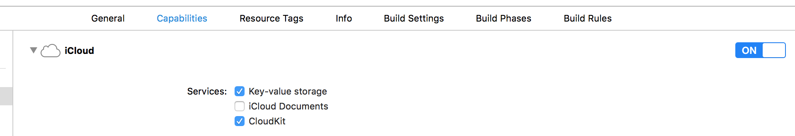

 * [Managing the UIApplicationDelegate instance](#managing-the-uiapplicationdelegate-instance)
 * [UIViewControllers and Story Boards](#uiviewcontrollers-and-story-boards)
     * [Initial controller](#initial-controllers)
 * [Key-Value stores](#key-value-stores)
     * [NSUserDefaults](#nsuserdefaults)
     * [Cloud based key value storage](#cloud-based-key-value-storage)
     * [Custom value transformers](#custom-value-transformers)

# Managing the UIApplicationDelegate instance

Alchemic has some special processing for `UIApplicationDelegate` instances. After starting, Alchemic will automatically search for a `UIApplicationDelegate` instance and if it finds one, inject any dependencies it needs. So there is no need to add any __AcRegister__ declarations to the app delegate class. *Note: You can still use __AcRegister__ to give the application delegate a name if you like.*

Alchemic will also automatically add an object factory for the delegate to its model and set it with your app's instance.

# UIViewControllers and Story Boards ##

For the moment Alchemic does not do any automatic processing of `UIViewController` instances because it's so easy to set them up. Instead, the simplest solution is to self inject in `awakeFromNib` or `viewDidLoad` like this:

```objc
-(void) viewDidLoad {
    AcInjectDependencies(self);
}
```

```swift
func viewDidLoad() {
    AcInjectDependencies(self)
}
```

*Note: that you can use __AcSet__ instead of __AcInjectDependencies__ if you also want Alchemic to inject the controller into other classes. 

## A Common Setup ##

Here's a typical `UIViewController` setup:

```objc
@implementation MyViewController 

AcRegister(AcWeak, AcNillable)

-(void) viewDidLoad {
    [super viewDidLoad];
    AcSet(self);
}

@end
```

The logic behind the __AcWeak__ and __AcNillable__ is to ensure that the object factory for it will not cause a retain cycle. Nillable means that if this controller is injected into something, a nil injection is allowed. This does depend on what the value is being injected into.

## Main Controllers

Often the main view controller of your app is instantiated from a story boards before Alchemic has had a chance to finish loaded and starting it's model. Therefore trying to get injections done on this view controller via __AcSet__ or __AcInjectDependencies__ will throw an error.

In this case you need to wrap your code in __AcWhenReady__ function like this:

```objc
-(void) viewDidLoad {
    AcWhenReady(^{
        AcInjectDependencies(self);
    });
}
```

__AcWhenReady__ passes the block to Alchemic which doesn't execute it until after Alchemic has finished starting and can perform any injections that the block may require. 

*Note: If Alchemic has managed to start before __AcWhenReady__  is called, then it will execute the block immediately.*

# Key-Value stores

## NSUserDefaults

Alchemic provides a set of tools for automatically managing data which you want stored in the user defaults area. Alchemics user defaults management feature is activated by adding the `AcEnabledUserDefaults` macro to any of your classes. You only need to add it once and Alchemic will automatically find it. For example:

```objc
@implementation MyClass
AcEnabledUserDefaults
@end
```

```swift
{{ site.data.code.swift-class }} {
    {{ site.data.code.swift-alchemic-method }} {
        AcEnabledUserDefaults()
    }
}
```

When you add this, Alchemic will automatically add user defaults support to the model by adding a singleton factory to the model which instantiates an instance of `ALCUserDefaults` on startup. `ALCUserDefaults` provides the following features:

 * Automatically locating the `Root.plist` file in the main bundle and if it exists, loading it's contents into the user defaults area.
 * Allows user defaults to be read or written by either KVC or subscripted calls to `ALCUserDefaults`. 
 * Supports you writing classes that extend `ALCUserDefaults` to implement properties for direct access to the settings. These properties will be automatically loaded with the current settings and have changed values saved.

Here's a more complete example of accessing the user defaults: 

```objc
@implementation MyClass {
    ALCUserDefaults *_defaults;
}

AcEnabledUserDefaults
AcInject(_defaults)

-(void) someMethod {
    NSString *name = _defaults["username"];
    _defaults["username"] = "derek";
}

@end
```

Setting a value automatically saves it to user defaults.

## Custom user defaults

By extending `ALCUserDefaults` to create your own class you can add properties to match the user defaults. You then declare the class as a singleton in Alchemic's model. With user defaults enabled, Alchemic will see your custom user defaults in the model and not add it's own.

When instantiated, the code inside the parent `ALCUserDefaults` will first load all user defaults into the properties, then locate all the writeable properties and KVO watch them. When you set a new value, the KVO watch will automatically forward it to the user defaults system. 

The up shot of this is that a fully Alchemic integrated user defaults with code completable properties, defaults sourced from a `Roots.plist` file, and backed by `[NSUserDefaults standardUserDefaults]` is a simple as this:

```objc
@interface MyUserDefaults: ALCUserDefaults
    @property (nonatomic, strong) NSString *username;
    @property (nonatomic, assign) int nbrLogins;
@end
```

```objc
@implementation MyUserDefaults
AcEnableUserDefaults
@end
```

```objc
@implementation MyClass {
    MyUserDefaults *_defaults;
}

AcInject(_defaults)

-(void) someMethod {
    NSString *name = _defaults.username;
    _defaults.username = "derek";
}

@end
```


## Cloud based key value storage

Apple provides a [cloud base key value storage](https://developer.apple.com/library/prerelease/content/documentation/General/Conceptual/iCloudDesignGuide/Chapters/DesigningForKey-ValueDataIniCloud.html) facility which you can use in your apps. Essentially this works exactly the same was as `NSUserDefaults` except the data is stored in the cloud rather than on the device. This enables a simple mechanism which can synchronise your data (within certain limits) between your devices.

To access the cloud store you need to switch on the iCloud and Key Value Storage in your apps capabilities like this:



Then you need to enabled Alchemic's Cloud Key Value Storage feature like this: 

```objc
@implementation MyClass
AcEnabledCloudKeyValueStore
@end
```

Alchemic's cloud key value storage feature works exactly like it's `ALCUserDefaults` counterpart and has the same functionality. It's based around the `ALCCloudKeyValueStore` class and included the ability to be extended if you want to create a custom class to access the data.

Here's the basic method for accessing cloud based values:

Here's a more complete example of accessing the user defaults: 

```objc
@implementation MyClass {
    ALCCloudKeyValueStore *_ckvs;
}

AcEnableCloudKeyValueStore
AcInject(_ckvs)

-(void) someMethod {
    NSString *name = _defaults["username"];
    _ckvs["username"] = "derek";
}

@end
```

## Custom value transformers

With all key value stores you can store values of types that are not natively supported by their backing stores. To do so, you need to implement two methods for each property which is of an unknown type.

```objc
-(id) <property-name>FromBackingStoreValue:(id) value;
-(id) backingStoreValueFrom<property-name>:(id) value;
``` 

For example if you want to store instances of `MyClass` in the cloud, you have to transform those instances into something that the cloud can store. Here's an example of implementing suitable transformers.

```objc
@interface MyCloudStore : ALCCloudKeyValueStore
// Defining a property is optional, but useful.
@property (nonatomic, strong) MyClass *myObject;
@end
```

```objc
@implementation MyCloudStore

-(MyClass *) myObjectFromBackingStoreValue:(NSDictionary *) values {
    MyClass *myClass = [[MyClass alloc] init];
    [MyClass setValuesForKeysWithDictionary:values];
    return myClass;
}

-(NSDictionary *) backingStoreValueFromMyObject:(id) myObj {
    return @[
        // myObj properties.
    ];
}

@end
```

When sending a value to or from the backing key value store, Alchemic will automatically search for and call these transformer methods if they exist. 